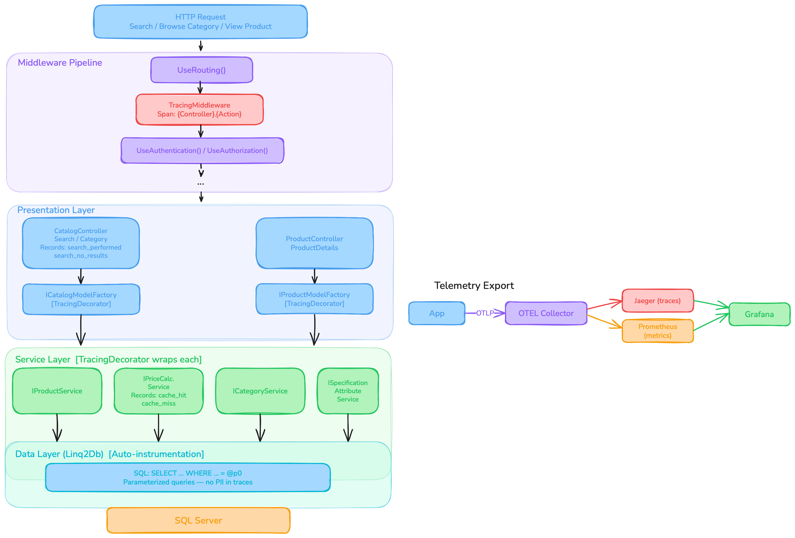
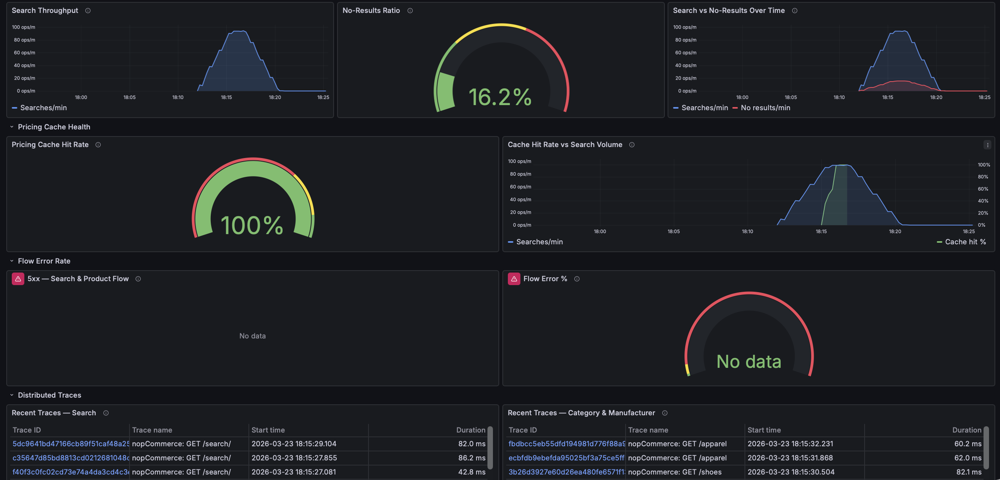
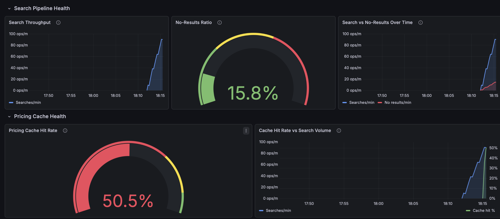
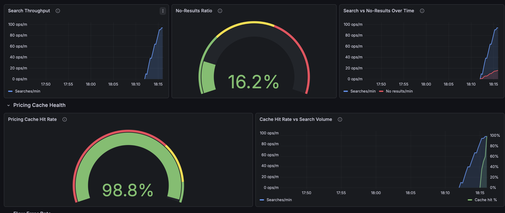
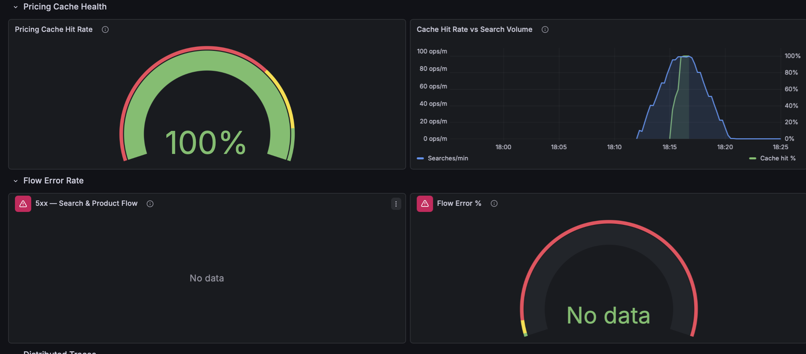
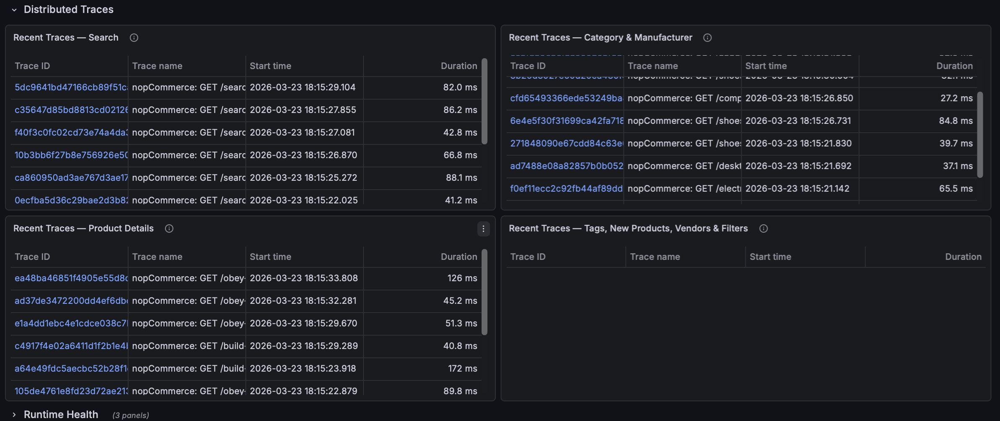

# nopCommerce — Observability Assignment

OpenTelemetry tracing and metrics instrumentation for nopCommerce, an open-source ASP.NET Core e-commerce platform.

**Instrumented flow:** Customer searches and views a product (Catalogue, Search, Pricing).

---

## Architecture Analysis

### Layered Architecture

NopCommerce uses a classic layered architecture with clear dependency rules:

### Layers (from lowest to highest)

- **Nop.Core**: Domain entities, interfaces, and infrastructure. No dependencies on other project layers.
- **Nop.Data**: Data access (repositories, migrations). Depends only on Nop.Core.
- **Nop.Services**: Business logic/services. Depends on Nop.Core and Nop.Data.
- **Nop.Web.Framework**: Shared MVC infrastructure for presentation and plugins. Depends on Nop.Core, Nop.Data, and Nop.Services.
- **Nop.Web**: The main ASP.NET Core MVC web app (controllers, views, entry point). Depends on all above layers.
- **Plugins**: Extension points, discovered and loaded at runtime. Depend on Nop.Web.Framework (and thus transitively on all lower layers).

### Dependency Rules

- Lower layers never reference higher ones (e.g., Nop.Core knows nothing about HTTP or MVC).
- Services use repositories from Nop.Data, not direct DB access.
- Plugins extend via interfaces and events, not by modifying core code.
- Presentation (Nop.Web) depends on all lower layers, but not vice versa.

### IEventPublisher — Internal Event Bus

nopCommerce uses an in-process pub/sub dispatcher called IEventPublisher. When code calls `PublishAsync(new SomeEvent(...))`, the EventPublisher resolves all registered `IConsumer<SomeEvent>` handlers from DI and invokes them sequentially. It does not use an external message broker, everything runs in-memory within the same process. Consumers are discovered at startup by assembly scanning.

This is a natural instrumentation boundary for flows that rely on events (e.g., order placement triggers inventory and email events). The search flow does not use IEventPublisher, it calls services directly from controllers and factories.

### Where Observability Is Easy

- **Middleware pipeline** — ASP.NET Core's middleware chain is a natural insertion point for cross-cutting concerns. Any request-level instrumentation (tracing, logging, metrics) can be added with a single middleware registration without touching controllers or routes.
- **DI boundary** — Because services are registered as interfaces, they can be decorated at registration time. This means observability can be added as a layer around existing services without modifying business logic.
- **Centralized registration** — All service registrations live in NopStartup.cs files, making it easy to identify all services in one place and apply instrumentation consistently.

### Where Observability Is Hard

- **Monolithic service methods** — Methods like SearchProductsAsync call into multiple other services (category, specification, pricing) within a single method body. Understanding the internal breakdown of work requires instrumenting each sub-service individually.

---

## Quick Start

### Prerequisites

- [Docker](https://www.docker.com/) (Docker Desktop or Docker Engine with Compose)
- [k6](https://k6.io/) (for load testing)

### Build and Run

```bash
docker compose up --build
```

This starts all services:

| Service | URL | Purpose |
|---|---|---|
| nopCommerce | http://localhost | The e-commerce store |
| Grafana | http://localhost:3000 | Dashboards (login: admin / admin) |
| Jaeger | http://localhost:16686 | Trace viewer |
| Prometheus | http://localhost:9090 | Metrics storage |
| OTEL Collector | localhost:4317 | Receives telemetry from the app |
| SQL Server | localhost:1433 | Database |

On first run, visit http://localhost to complete the nopCommerce installation wizard.

### Run the Load Test

```bash
k6 run loadtest/search-browse.js
```

The script simulates shoppers browsing the store: searching products, viewing categories, and opening product detail pages. It ramps to 20 virtual users, sustains for 3 minutes, then ramps down.

### View the Dashboard

1. Open Grafana at http://localhost:3000 (admin / admin)
2. Go to **Dashboards** and select **nopCommerce — Operations**
3. The dashboard auto-refreshes every 10 seconds

To view individual traces, open Jaeger at http://localhost:16686, select service **nopCommerce**, and search for operations like `Catalog.Search`, `Catalog.Category`, or `Product.ProductDetails`.

---

## Observability Stack

```
nopCommerce (.NET 9)
    │
    │  OTLP gRPC (port 4317)
    ▼
OTEL Collector
    │
    ├──▶  Jaeger (traces) ────┐
    │                         ├──▶  Grafana
    └──▶  Prometheus (metrics)┘
```

The app exports both traces and metrics via OTLP to the OpenTelemetry Collector. The collector forwards traces to Jaeger and exposes a Prometheus scrape endpoint for metrics. Grafana queries both backends.

**Configuration:** The OTLP endpoint is set via the `Otlp__Endpoint` environment variable (set to `http://otel-collector:4317` in docker-compose).

---

## Architecture Diagram



---

## Tracing

Traces are created at three levels, giving end-to-end visibility from HTTP request to database:

### 1. Controller level — TracingMiddleware

A middleware registered after `UseRouting()` that creates a span for every MVC controller action. Span name format: `{Controller}.{Action}` (e.g., `Catalog.Search`, `Product.ProductDetails`).

Non-MVC requests (static files, health checks) are skipped.

**File:** [`src/Presentation/Nop.Web.Framework/Infrastructure/TracingMiddleware.cs`](src/Presentation/Nop.Web.Framework/Infrastructure/TracingMiddleware.cs)

### 2. Service and Factory level — TracingDecorator (DispatchProxy)

A `DispatchProxy`-based decorator that wraps DI-registered service interfaces. Every method call on a wrapped interface gets its own span (e.g., `CatalogModelFactory.PrepareSearchModel`, `ProductService.SearchProductsAsync`).

Tracing is added at the DI boundary using `TracingDecorator.AddTracing()`, existing service registrations stay untouched. No business logic is modified.

**Instrumented services (4):** IProductService, IPriceCalculationService, ICategoryService, ISpecificationAttributeService

**Instrumented factories (2):** ICatalogModelFactory, IProductModelFactory

The search flow touches more services (e.g., IManufacturerService, ICurrencyService, ITaxService, IDiscountService), but wrapping all of them would add noise to traces without providing actionable insight. The four selected services represent the core path: product lookup, price calculation, category resolution, and specification filtering.

**File:** [`src/Presentation/Nop.Web.Framework/Infrastructure/TracingDecorator.cs`](src/Presentation/Nop.Web.Framework/Infrastructure/TracingDecorator.cs)

### 3. Infrastructure level — Auto-instrumentation

ASP.NET Core, HTTP client, and SQL client instrumentation are enabled via the OpenTelemetry SDK in `Program.cs`. These capture HTTP request/response metadata and database queries automatically.

### Trace example: `GET /search?q=shoes`

```
Catalog.Search                              (TracingMiddleware)
  └── CatalogModelFactory.PrepareSearchModel     (TracingDecorator)
        ├── ProductService.SearchProductsAsync    (TracingDecorator)
        │     └── SQL: SELECT ...                 (auto-instrumentation)
        ├── PriceCalculationService.GetFinalPrice (TracingDecorator)
        │     └── SQL: SELECT ...
        └── CurrencyService.GetPrimaryStoreCurrency (TracingDecorator)
```

---

## Custom Metrics

### 1. `search_performed_total` / `search_no_results_total`

**What they are:** search_performed counts every non-empty search query submitted. search_no_results counts the subset that returned zero products.

**What they tell an operator:** The key signal is the **ratio** search_no_results / search_performed. If it's normally ~10% and suddenly jumps to 80%, something is broken — search index corrupted, catalog data missing, database connection degraded — even though the app is still returning HTTP 200. This detects degradation before users start filing complaints. A drop in search_performed alone could mean fewer users or a broken search page.

**Instrumented in:** CatalogController.Search() and CatalogController.SearchProducts() — after the search model is prepared. search_no_results only fires when model.Products is empty.

### 2. `pricing_cache_hit_total` / `pricing_cache_miss_total`

**What they are:** Count pricing cache hits and misses in PriceCalculationService.GetFinalPrice(). Together they enable a cache hit rate ratio.

**What they tell an operator:** The cache hit rate (hits / (hits + misses) * 100) is a leading indicator for performance degradation. The pricing pipeline runs on every search result listing and every product detail page. A healthy cache shows 90%+. A drop means the app was restarted (cold cache — rate climbs from 0% as cache warms), cache TTL expired or was misconfigured, memory pressure is evicting entries, or new products are flooding in from a catalog import. A raw miss counter alone can't tell you if 50 misses is bad (50 out of 50 = 100% miss) or fine (50 out of 10,000 = 0.5% miss). The ratio makes it immediately actionable.

**Instrumented in:** PriceCalculationService.GetFinalPrice() — after the _staticCacheManager.GetAsync() call. Miss fires when cacheHit is false, hit fires in the else branch.

**Note:** Pricing cache requires CacheProductPrices = true in Admin → Configuration → Settings → Catalog → Performance.

---

## Sensitive Data Exclusion

The chosen flow (Search → Browse → View Product) is inherently low-risk for PII — it involves no authentication, payment, or customer profile data. The most sensitive value that could appear is the search query itself. Still, the instrumentation applies defensive measures:

1. **TracingDecorator tags only safe primitives.** The `SetSafeTags()` method whitelists `int`, `long`, `bool`, `decimal`, and `enum` values. Strings and objects are excluded — customer names, emails, and addresses are never tagged on spans.

2. **SQL uses parameterized queries.** Linq2Db generates parameterized SQL, so traces show `WHERE [t].[Email] = @p0` rather than actual values. `SetDbStatementForText = true` captures the query template, not parameter values.

3. **Metrics carry no attribute tags.** All four counters use `.Add(1)` with no dimensions, no customer data or search terms are attached.

4. **TracingMiddleware records only route metadata.** Controller and action names come from route values, not query strings or request bodies.

---

## Grafana Dashboard

The dashboard is auto-provisioned when Docker starts (no manual import needed).

**Exported JSON:** `grafana/dashboards/nopcommerce.json`

### Dashboard overview



### Search Pipeline Health + Pricing Cache (cache warming)



### Search Pipeline Health + Pricing Cache (cache warmed)



### Pricing Cache at 100% + Flow Error Rate



### Distributed Traces



### Dashboard sections

**Search Pipeline Health**
- Search Throughput — rate of search queries per minute
- No-Results Ratio — gauge showing % of searches returning zero results (green < 30%, yellow 30-60%, red > 60%)
- Search vs No-Results Over Time — overlay to correlate degradation timing

**Pricing Cache Health**
- Pricing Cache Hit Rate — gauge showing cache effectiveness (red < 70%, yellow 70-90%, green > 90%)
- Cache Hit Rate vs Search Volume — overlay to spot cache degradation under load

**Flow Error Rate**
- 5xx — Search & Product Flow — error rate on flow-specific endpoints vs site-wide
- Flow Error % — gauge showing error percentage (green < 1%, yellow 1-5%, red > 5%)

**Distributed Traces** (Jaeger)
- Recent Traces — Search (search, autocomplete)
- Recent Traces — Category & Manufacturer
- Recent Traces — Product Details
- Recent Traces — Tags, New Products, Vendors & Filters

---

## Load Testing

The k6 script simulates a shopper browsing the store:

1. Visit the homepage
2. Search for a product (e.g., "shoes", "laptop") — triggers `search_performed`
3. Occasionally search for non-existent terms — triggers `search_no_results`
4. Use search autocomplete
5. Browse a category page
6. View a product detail page — triggers `pricing_cache_hit` / `pricing_cache_miss`

```bash
k6 run loadtest/search-browse.js
```

**Profile:** 20 virtual users, 3 minutes sustained, with 30s ramp-up/down.

**Script:** [loadtest/search-browse.js](loadtest/search-browse.js)

---

## LLM Usage

LLM was used as an interactive collaborator throughout every phase of this project:

- **Explainer** — Navigating the nopCommerce codebase, understanding its DI setup and identifying extension points for observability.
- **Discusser** — Supported evaluation of design trade-offs.
- **Implementer** — Helped draft and refine code (e.g., TracingMiddleware, decorator, metrics instrumentation, Docker Compose setup, and k6 tests).
- **Debugger** — Troubleshooting, collector configuration.
- **Documenter** — Drafting README sections.


## Organizational Documents

- [CRITIQUE.md](CRITIQUE.md)
- [Presentation](./AS%20-%201Project%20Presentation.pdf)
